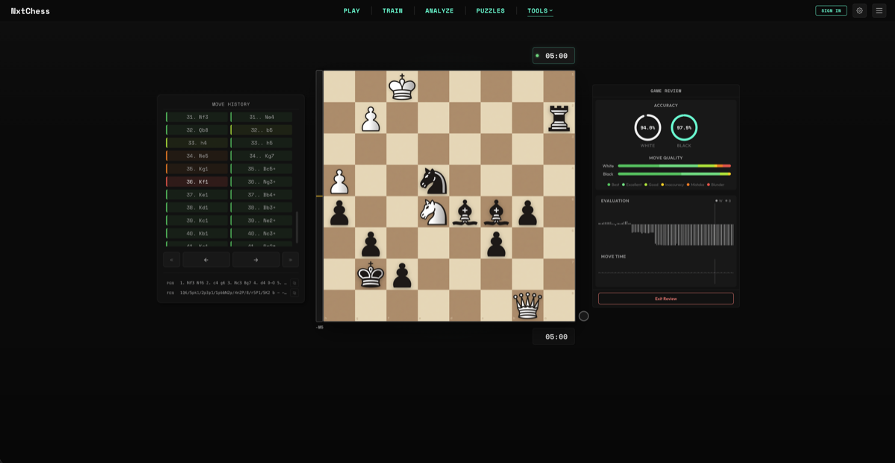
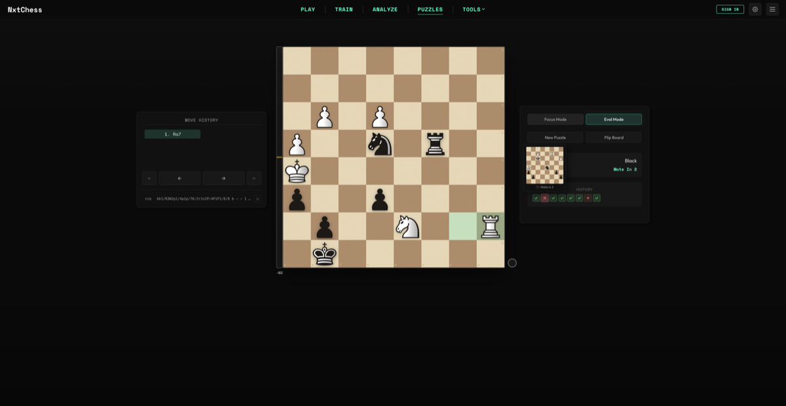
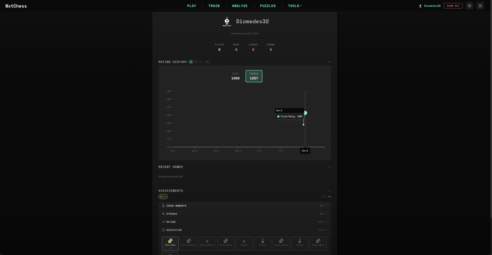

# NxtChess

[](LICENSE)
[](LICENSES/GPL-3.0.txt)
[](#)

A multiplayer chess PWA with game review, puzzles, training, and analysis. Built for low-latency play in SolidJS + Go.

[**Live build**](https://nxtchess.up.railway.app/) deployed on Railway.

|                    Game Review                     |                     Puzzles                     |                     Profile                     |
| :------------------------------------------------: | :---------------------------------------------: | :---------------------------------------------: |
|  |  |  |

## Features

- **Multiplayer**: Real-time WebSocket games, shareable links, lobby, server-managed clocks, reconnection with 20s grace period
- **Game Review**: Post-game analysis with move-by-move evaluation, accuracy scoring, and eval graphs
- **Puzzles**: Mate in 1/2/3, Elo-based difficulty and history
- **Analysis**: Multi-line Stockfish analysis, plus FEN/PGN import
- **Training**: Endgame drills with evaluation, hints, and scoring
- **Profiles**: Ratings, charts, stats, and recent games
- **Achievements**: Badge system with streaks and notifications

## Quick Start

**Prerequisites:**

- [Docker](https://www.docker.com/products/docker-desktop/)
- [Just](https://github.com/casey/just#installation)

```bash
git clone https://github.com/tmcarmichael/nxtchess.git
cd nxtchess
just dev
```

Open http://localhost:5173

To spin up just the frontend without auth/db:

**Prerequisites:**

- [Node](https://nodejs.org/en/download) (16.10+)
- Yarn: Already bundled with Node 16.10+, run: `corepack enable`

```bash
cd apps/frontend && yarn install && yarn dev
```

## Tech Stack

| Layer      | Stack                                                                      |
| ---------- | -------------------------------------------------------------------------- |
| Frontend   | SolidJS, TypeScript, Vite, CSS Modules                                     |
| Backend    | Go, Chi, gorilla/websocket                                                 |
| Database   | PostgreSQL, Redis                                                          |
| Engine     | Stockfish 16.1 WASM (adaptive: multi-threaded 69MB or single-threaded 7MB) |
| Monitoring | Prometheus, Loki, Grafana                                                  |
| Infra      | Docker, Caddy, Railway                                                     |

## Commands

```bash
just dev                    # Start all services
just up PROFILES=backend    # Backend only
just up PROFILES=frontend   # Frontend only
just logs                   # Follow logs
just clean PROFILES=full    # Reset everything
just mon-up                 # Start monitoring (Prometheus, Loki, Grafana)
just mon-down               # Stop monitoring
```

## Architecture

SolidJS PWA with Stockfish WASM for client-side analysis, AI play, and post-game review. Go backend handles WebSocket multiplayer with server-managed clocks, server-side move validation, Elo-rated play, and reconnection support.

PostgreSQL for persistence, Redis for sessions, Caddy reverse proxy. Prometheus metrics, Loki log aggregation, and Grafana dashboards for observability.

## Roadmap

**Training & Analysis**

- Syzygy tablebases integration (perfect endgame play)
- Opening explorer with master game statistics
- Themed puzzles (forks, pins, back rank mates) with spaced repetition
- Middlegame training mode

**Multiplayer & Competitive**

- Tournaments (Swiss and arena formats)
- Elo range filtering for lobby

**Platform**

- Opening repertoire tracking
- Mobile app
- CI/CD

## Deployment

Production deploys are triggered from the `deploy` branch. Maintainers can merge to and push to `deploy`.

- `main`: development + CI (tests/lint/build)
- `deploy`: production branch watched by Railway (protected)

## Third-Party Licenses

NxtChess's original source code is licensed under [Apache 2.0](LICENSE).

This project uses the [Stockfish](https://github.com/official-stockfish/Stockfish) chess engine, which is licensed under the **GNU General Public License v3 (GPLv3)**. Stockfish is distributed unmodified as a WASM binary (via [stockfish.js](https://github.com/nmrugg/stockfish.js) 16.1.0) and runs in a dedicated WebWorker, communicating with the UI via UCI messages.

The Stockfish WASM binary served by this project remains GPLv3 licensed. See [LICENSES/GPL-3.0.txt](LICENSES/GPL-3.0.txt) and [LICENSES/Stockfish-NOTICE.txt](LICENSES/Stockfish-NOTICE.txt) for the full license text, attribution, and corresponding source details.

## Contributing

Contributions welcome. Please open an issue first to discuss changes.
