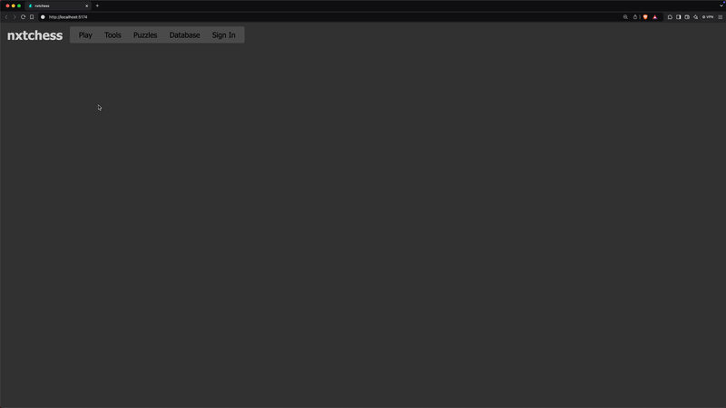

# nxtchess - Next Generation Chess

[](#)
[](https://github.com/tmcarmichael/nxtchess/blob/main/LICENSE)
[](https://github.com/tmcarmichael/nxtchess/issues)
[](https://prettier.io/docs/en/why-prettier)

<div style="text-align: center;">
  
</div>

## 🚀 Vision

The goal is to create a high-performance multiplayer chess platform that incorporates unique training modes and AI-driven features. Key objectives include:

- **Real-time Multiplayer**: Delivering seamless, responsive gameplay.
- **Personalized User Experience**: Supporting accounts with game histories and performance tracking.
- **Comprehensive Game Database**: Enabling players to study and analyze past games.
- **AI-Powered Tools**: Providing game reviews and training modes to help players improve their skills.

**_The project is currently in early development, with a focus on building the frontend client and core game logic. Check out the Roadmap below for more details on our plans and progress._**

---

## 💻 Tech Stack

### Frontend: **SolidJS**

The frontend is built with **SolidJS**, a modern JavaScript library known for its **fine-grained reactivity** and **high performance**. Why was **SolidJS** chosen?

1. **Fine-Grained Reactivity**:

   - Unlike traditional virtual DOM-based libraries (e.g., React), SolidJS updates the DOM precisely where changes occur.
   - This granular approach minimizes unnecessary renders and improves performance, especially for highly interactive interfaces like a chessboard.

2. **Minimal Overhead**:

   - SolidJS compiles components into lightweight, efficient JavaScript code. There's no runtime virtual DOM diffing, which makes the app faster and more memory-efficient.

3. **Scalability**:

   - The reactive core of SolidJS allows the app to scale seamlessly without introducing complexity. This will be critical as we implement multiplayer features, live spectating, and analysis tools.

### Styling

- **CSS Modules** are used for scoped, maintainable styling, ensuring that each component has its own isolated styles.
- The chessboard design is minimalistic, with clean visuals optimized for both desktop and mobile experiences.

---

## 📜 Roadmap

What’s planned?

### Phase 1: Core Gameplay ✅

- [x] Chessboard rendering.
- [x] Responsive design.
- [x] Implement full chess rules (move validation, checkmate detection, etc.).
- [x] Add drag-and-drop functionality for intuitive piece movement.
- [x] Highlight squares for legal moves when clicking pieces.
- [x] Checkmate, game end, and game restart logic

### Phase 2: Core Non-Gameplay elements

- [x] Game Panel initial implementation
- [ ] Implement basic AI for dev testing, 1500 ELO
- [ ] Game Panel functional for AI play with time controls 3min, 5min, 10min

### Phase 3: Multiplayer 1

- [ ] Game Panel functional for human websocket play
- [ ] Landing page for site and joining queue for websocket play
- [ ] Account creation and sign in.
- [ ] Database for accounts, played games, rating system and more.
- [ ] Caching layer for database.
- [ ] Integrate WebSocket-based real-time communication for multiplayer gameplay.

### Phase 4: Multiplayer 2

- [ ] Spectator mode for watching live games.
- [ ] Rating system and matchmaking.

### Phase 5: AI and Analysis

- [ ] Integrate an AI engine (e.g., Stockfish) for single-player games and post-game analysis.
- [ ] Allow users to explore opening libraries and endgames.

### Phase 6: Expanded Tools and Options

- [ ] AI training modes.
- [ ] AI game reviews.
- [ ] Host public database of games.
- [ ] Database explorer view with board moves.
- [ ] Puzzles and Puzzle ELO.

### Phase 6: Community Features

- [ ] Tournament system.
- [ ] Player profiles and statistics.
- [ ] Anti-cheat mechanisms.

---

## 🛠️ Getting Started

### Prerequisites

- **Node.js** (v16 or later)
- **npm** (v7 or later)

### Installation

1. Clone this repository:
   ```bash
   git clone https://github.com/tmcarmichael/nxtchess.git
   ```
2. Navigate to the project directory:
   ```bash
   cd nxtchess
   ```
3. Install dependencies:
   ```bash
   npm install
   ```
4. Start the development server:
   ```bash
   npm run dev
   ```
5. Open your browser and navigate to the localhost port suggested by Vite, such as:
   ```
   Local:   http://localhost:5173/
   ```

---

## 🤝 Contributing

Contributions welcome!

1. Fork the repository.
2. Create a feature branch:
   ```bash
   git checkout -b my-new-feature
   ```
3. Commit your changes:
   ```bash
   git commit -m "Add some feature"
   ```
4. Push to the branch:
   ```bash
   git push origin my-new-feature
   ```
5. Open a pull request.

---

## 📧 Contact

For inquiries, suggestions, or feedback, feel free to reach out:

- Email: ThomasCarmichael@pm.me
- GitHub Issues: [Submit an Issue](https://github.com/tmcarmichael/nxtchess/issues)
