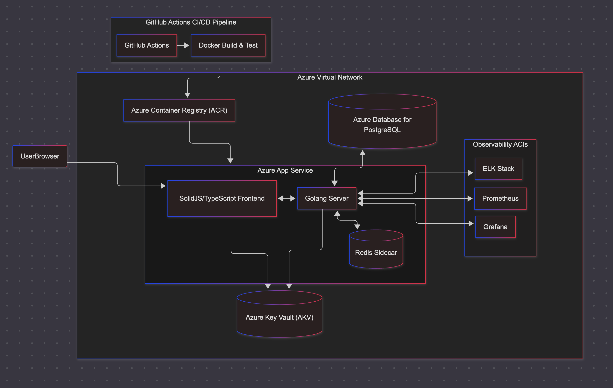

# NxtChess

[](#)
[](https://github.com/tmcarmichael/nxtchess/blob/main/LICENSE)
[](https://github.com/tmcarmichael/nxtchess/issues)

NxtChess is a multiplayer chess platform with AI training modes. Play anonymous games via shareable links or sign in to track ratings and game history.

## Features

- **Multiplayer** — Real-time games via WebSocket with shareable game links
- **AI Training** — Play against Stockfish with configurable difficulty and playstyles
- **Time Controls** — Blitz, rapid, and classical with increment support
- **Server-side Validation** — All moves validated server-side to prevent cheating

## Quick Start

Requires [Docker Desktop](https://www.docker.com/products/docker-desktop/) and [Just](https://github.com/casey/just#installation).

```bash
just dev
```

Open [http://localhost:5173](http://localhost:5173). Press `Ctrl+C` to stop.

For OAuth sign-in, add credentials to `apps/backend/.env` (see `.env.example`).

## Tech Stack

| Layer          | Technologies                                        |
| -------------- | --------------------------------------------------- |
| Frontend       | SolidJS, TypeScript, Vite, CSS Modules              |
| Backend        | Go, Chi, WebSocket, Redis, PostgreSQL               |
| Engine         | Stockfish WASM (browser), Stockfish binary (server) |
| Infrastructure | Docker, Caddy, GitHub Actions                       |

## Development

```bash
just up PROFILES=backend    # Backend only
just up PROFILES=frontend   # Frontend only
just logs PROFILES=backend  # Follow logs
just exec-db                # PostgreSQL shell
just exec-redis             # Redis CLI
just clean PROFILES=full    # Remove containers and volumes
```

Run `just` to see all commands.

## Roadmap

| Status  | Milestone                                                                                 |
| ------- | ----------------------------------------------------------------------------------------- |
| Done    | WebSocket multiplayer, server-side validation, time controls, AI training, OAuth, ratings |
| Current | Production deployment, game persistence, reconnection handling                            |
| Next    | CI/CD, observability, tournaments, social features                                        |

## Architecture Northstar

<div style="text-align: center;">
  
</div>

## Contributing

Contributions welcome. Open an issue or submit a PR.

## Contact

- Email: ThomasCarmichael@pm.me
- Issues: [GitHub Issues](https://github.com/tmcarmichael/nxtchess/issues)
