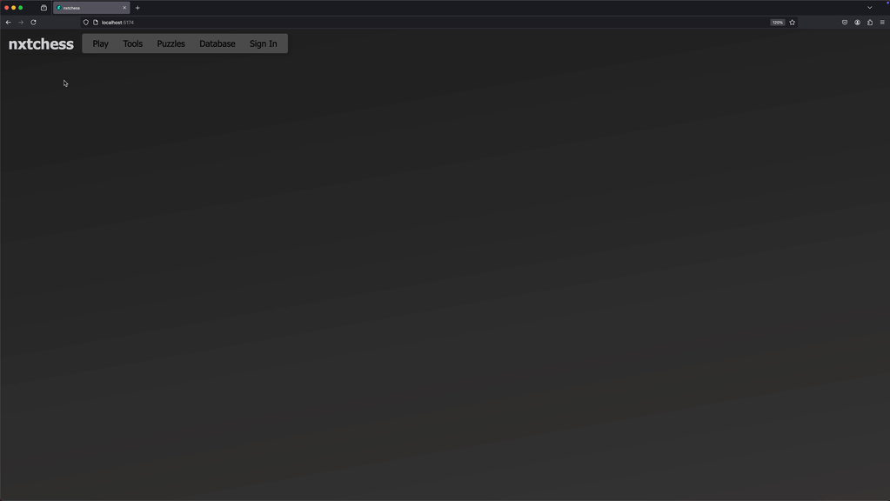

# nxtchess - Next Generation Chess

[](#)
[](https://github.com/tmcarmichael/nxtchess/blob/main/LICENSE)
[](https://github.com/tmcarmichael/nxtchess/issues)
[](https://prettier.io/docs/en/why-prettier)

<div style="text-align: center;">
  
</div>

## 🚀 Vision

The goal is to create a high-performance multiplayer chess platform that incorporates unique training modes and AI-driven features. Key objectives include:

- **Real-time Multiplayer**: Delivering seamless, responsive gameplay.
- **Personalized User Experience**: Supporting accounts with game histories and performance tracking.
- **Comprehensive Game Database**: Enabling players to study and analyze past games.
- **AI-Powered Tools**: Providing game reviews and training modes to help players improve their skills.

**_The project is currently in early development, with a focus on building the frontend client and core game logic. Check out the Roadmap below for more details on our plans and progress._**

---

## 💻 Tech Stack

### Frontend: **SolidJS**

The frontend is built with **SolidJS**, a modern JavaScript library known for its **fine-grained reactivity** and **high performance**. Why was **SolidJS** chosen?

1. **Fine-Grained Reactivity**:

   - Unlike traditional virtual DOM-based libraries (e.g., React), SolidJS updates the DOM precisely where changes occur.
   - This granular approach minimizes unnecessary renders and improves performance, especially for highly interactive interfaces like a chessboard.

2. **Minimal Overhead**:

   - SolidJS compiles components into lightweight, efficient JavaScript code. There's no runtime virtual DOM diffing, which makes the app faster and more memory-efficient.

3. **Scalability**:

   - The reactive core of SolidJS allows the app to scale seamlessly without introducing complexity. This will be critical as we implement multiplayer features, live spectating, and analysis tools.

### Styling

- **CSS Modules** are used for scoped, maintainable styling, ensuring that each component has its own isolated styles.
- The chessboard design is minimalistic, with clean visuals optimized for both desktop and mobile experiences.

---

## 📜 Roadmap

What’s planned?

### Phase 1: Core Gameplay ✅

- [x] Chessboard rendering.
- [x] Responsive design.
- [x] Implement full chess rules (move validation, checkmate detection, etc.).
- [x] Add drag-and-drop functionality for intuitive piece movement.
- [x] Highlight squares for legal moves when clicking pieces.
- [x] Checkmate, game end, and game restart logic.
- [x] Game Panel initial implementation.
- [x] Implement basic AI (easy/medium/hard).
- [x] Game Panel functional for AI play with time controls (3min, 5min, 10min).
- [x] Game clock & board flip functionality.

### Phase 2: Polished Core Gameplay and Non-Gameplay Essentials

- [ ] Containerize frontend for development (Docker builds for local and later server integration).
- [ ] Navigation panel and game move history.
- [ ] Implement "take back last move" functionality.
- [ ] Add keyboard shortcuts for web app interaction.
- [ ] _(Nice to have)_ Adopt a styling library (Tailwind, PostCSS, or Macaron).
- [ ] _(Nice to have)_ Enhance board resizing, accessibility, and cross-browser compatibility.
- [ ] _(Nice to have)_ Enable full offline AI mode via service worker after initial bundle download.

### Phase 3: Server for Move Validation and Multiplayer

- [ ] Develop a Golang REST server to handle game start and related endpoints.
- [ ] Wrap Stockfish binary with Golang, interfacing via UCI for engine evaluation.
- [ ] Containerize the backend for local testing alongside the frontend.
- [ ] Configure Docker Compose to orchestrate FE and BE builds for rapid local development.
- [ ] Remove/refactor frontend AI move logic in favor of server-side evaluation (except for offline mode).
- [ ] Implement full end-to-end tests covering both frontend and backend.
- [ ] Push containers to a registry for deployment.

### Phase 4: Deployment, Logging, and Monitoring Setup

- [ ] Establish a CI/CD pipeline for automated builds, testing, and deployments.
- [ ] Deploy frontend and backend containers to staging and production environments.
- [ ] Integrate centralized logging (ELK/Fluentd) for real-time error tracking.
- [ ] Configure monitoring and alerting (Prometheus, Grafana, Sentry) for system performance.
- [ ] Implement health checks and auto-scaling policies for robust deployments.

### Phase 5: Database and User Account Setup

- [ ] Integrate PostgreSQL for persistent storage of game data, user profiles, and history.
- [ ] Implement secure user authentication and authorization (JWT/OAuth2).
- [ ] Develop REST API endpoints for user management and game history retrieval.
- [ ] Enable real-time analytics and player statistics tracking.
- [ ] _(Nice to have)_ Introduce lightweight GraphQL endpoints for efficient client queries.

### Phase 6: Advanced Features

- [ ] Develop unique AI chess game modes, training tools, and interactive tutorials.
- [ ] Build a tournament system.
- [ ] Enhance player profiles with detailed statistics.
- [ ] Integrate anti-cheat mechanisms.

---

## 🛠️ Getting Started

### Prerequisites

- **Node.js** (>v16)
- **pnpm**

### Installation

1. Clone this repository:
   ```bash
   git clone https://github.com/tmcarmichael/nxtchess.git
   ```
2. Navigate to the project directory:
   ```bash
   cd nxtchess
   ```
3. Install dependencies:
   ```bash
   pnpm install
   ```
4. Start the development server:
   ```bash
   pnpm run dev
   ```
5. Open your browser and navigate to the localhost port suggested by Vite, such as:
   ```
   Local:   http://localhost:5173/
   ```

---

## 🤝 Contributing

Contributions welcome!

1. Fork the repository.
2. Create a feature branch:
   ```bash
   git checkout -b my-new-feature
   ```
3. Commit your changes:
   ```bash
   git commit -m "Add some feature"
   ```
4. Push to the branch:
   ```bash
   git push origin my-new-feature
   ```
5. Open a pull request.

---

## 📧 Contact

For inquiries, suggestions, or feedback, feel free to reach out:

- Email: ThomasCarmichael@pm.me
- GitHub Issues: [Submit an Issue](https://github.com/tmcarmichael/nxtchess/issues)
